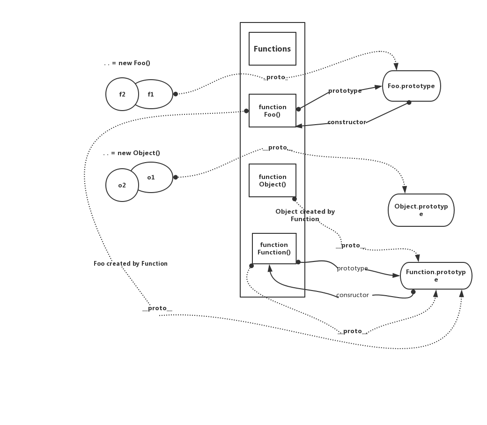

###classList新增方法
classList.add("")|添加多个类名
---|---
.remove()|移除
.length | 长度
.toggle("name")|有删除 ,无添加
.contains| 判断是否存在 true`/`false

###dataSet
ele.dataset|返回含data-XXX的数据
---|---
ele.dataset['aBcD'] ='1'|data-a-bc-d = "1"
delete ele.dataset['a'] | 删除 data-a
####atob-btoa<br>

atob|解析成我们能够识别的数据
--|--
btoa| 编译成计算识别的编码

####防抖与节流
```
 window.onload = function(){
            var myDebounce = document.getElementById("debounce");
            var myThrottle = document.getElementById("throttle");
            myDebounce.addEventListener("click" ,  debounce(sayDebounce));
            myThrottle.addEventListener("click" , throttle(sayThrottle));
        }
        //防抖功能的函数
        function debounce(fn){
            let timeout = null;
            return function(){
                clearTimeout(timeout);

                timeout = setTimeout(()=>{
                    fn.call(this , arguments);
                } , 1000);
            }
        }
        function sayDebounce(){
            console.log("防抖成功!!");
        }
        ///节流功能的函数
        function throttle(fn) {
            let canRun = true;
            return function(){
                if(!canRun){
                    return;
                }
                canRun = false;
                setTimeout(()=>{
                    fn.call(this , arguments);
                    canRun = true;
                } , 1000)
            }
        }
        function sayThrottle(){
            console.log("节流成功");
        }

```
####重绘与回流
```

```
####Proxy()
```
let p = new Proxy(target , handler);

```
####Object.create();创建object
#### 后台接收参数 @RequestParam ajax的data类型 json<br>后台接受参数 @@RequestBody ajax的data类型 String

####原型链




####const在es5中的使用
```js
	var _const = function _const(data , value){
        window.data = value;
        Object.defineProperty(window, data , {
            enumrable:false,
            configurable:false,
            get:function(){
                return value;
            },
            set:function(){
                if (data !== value) {
                    // statement
                    throw  new TypeError('Assignment to constant variable.')
                } else {
                    // statement
                    return value;
                }
            }
        })
       }
```

#####memary cache内存中的缓存 && disk cache 硬盘的缓存


####Class 继承示例

```
//bad 
function Queue(contents = []){
	this._queue = [...contents];
}
Queue.prototype.pop = function() {
	const value = this._queue[0];
	this._queue.splice(0 , 1);
	return value;
}
// good

class Queue {
	constructor(contents = []) {
		this._queue = [...contents];
	}
	pop() {
        const value = this._queue[0];
		this._queue.splice(0 , 1)
		return value;
    }
}

//使用extends实现继承,不会有破坏 instanceof 运算的危险

//bad
const inherits = require('inherits');
function PeekableQueue(contents) {
	Queue.apply(this , contents);
}
inherits(PeekableQueue , Queue);
PeekableQueue.prototype.peek = function() {
	return this.queue[0];
}
//good
class PeekableQueue extends Queue {
	peek() {
		return this._queue[0];
	}
}
 
```


###Symbol()的使用
- ####每个Symbol值都是唯一的,因此该值不与其他任何值相等
 
```
let symbol1 = Symbol();
let symbol2 = Symbol();

console.log( symbol1 === symbol2); 
>false
```
- ####Symbol值不能与其它类型的值进行运算,会报错,Symbol可以显式转为字符串,也可以转为布尔值

```
let sym = Symbol('My symbol');

"your symbol is " + sym
//TypeError: can't convert symbol to string
`your symbol is ${sym}`
//TypeError: can't convert symbol to string
```
###作为属性名的symbol

- ####由于每个symbol的值都不相等,意味着Symbol值可以作为标识符

```
let mySymbol = Symbol();

//first write methods
let a = {};
a[mySymbol] = 'Hello!';
//second
let a = {
    [mySymbol]: 'Hello!'
};
//third
let a = {};
Object.definProperty(a , mySymbol, { value: 'Hello'});

// 以上写法的结果相同
a[mySymbol] //"Hello!"
```
###Symbol属性名的遍历
```
Symbol作为属性名,不会出现在for .. in , for ... of 循环中, 也不会被Object.keys() , Object.getOwnPropertyNames() , JSON.stringify()返回
但Object.getOwnPropertySymbols(obj);方法返回一个数组,成员是当前对象的所有用作属性名的Symbol值
----
const obj = {};
let a = Symbol('a');
let b = Symbol('b');

obj[a] = 'Hello';
obj[b] = 'World';

const objectSymbols = Object.getOwnPropertySymbols(obj);

objectSymbols//[Symbol(a) , Symbol(b)]
---- Reflect.ownKeys方法可以返回所有类型的键名 包括常规键名 与 Symbol键名 
let obj = {
	[Symbol('my_key')]:1,
	enum:2,
	nonEnum:3
}

Reflect.ownKeys(obj);
----由于以Symbol值作为名称的属性不会被常规方法遍历得到,可以为对象定义一些非私有的,用于内部的方法

let size = Symbol('size');

class Collection{
	constructor(){
		this[size] = 0;
	}
	add(item){
		this[this[size]] = item;
		this[size] ++;
	}
	static sizeof(instance) {
		return instance[size]
	} 
}
let x = new Collection();
Collection.sizeof(x)

x.add('foo');
Collection.sizeOf(x);

Object.keys(x) // ['0']
Object.getOwnPropertyNames(x)//['0']
Objec.getOwnPropertySymbols(x) // [Symbol(size)]

```
###Symbol.for() , Symbol.keyFor()
```
Symbol.for() 与 Symbol() 都会生成新的 Symbol 前者会被登记在全局供搜索,后者不会
----
Symbol.for("bar") === Symbol.for("bar")
// true

Symbol("bar") === Symbol("bar")
// false
----
Symbol.keyFor方法返回一个已登记的Symbol类型值的key
----
let s1 = Symbol.for("foo");
Symbol.keyFor(s1) // "foo"

let s2 = Symbol("foo");
Symbol.keyFor(s2) // undefined

```

###模块的Singleton模式
- Singleton 模式指的是调用一个类,任何时候返回同一实例

```
function A(){
  this.foo = 'hello';
}

if(!global._foo){
  global._foo = new A();
}
module.exports = global._foo;
```
- 引入上面的代码时 , a任何时候加载都是A的同一个实例, 但是全局变量global._foo 是可以改写的,任何文件都可以修改

```
global._foo = {foo : 'world'}; // 修改了变量
const a = require('./mod.js');
console.log(a.foo);
```
- 可以保证 global[FOO_KEY]不会被无意间覆盖 , 但仍可改写

```
const FOO_KEY = Symbol.for('foo');

function A() {
  this.foo = 'hello';
}

if(!global[FOO_KEY]) {
  global[FOO_KEY] = new A();
}

module.exports = global[FOO_KEY];
```

```
global[Symbol.for('foo')] = {foo :'world !'};

```

- 如果键名使用Symbol方法生成 , 那么外部将无法引用这个值 , 也无法改写

```
const FOO_KEY = Symbol('foo');

```


